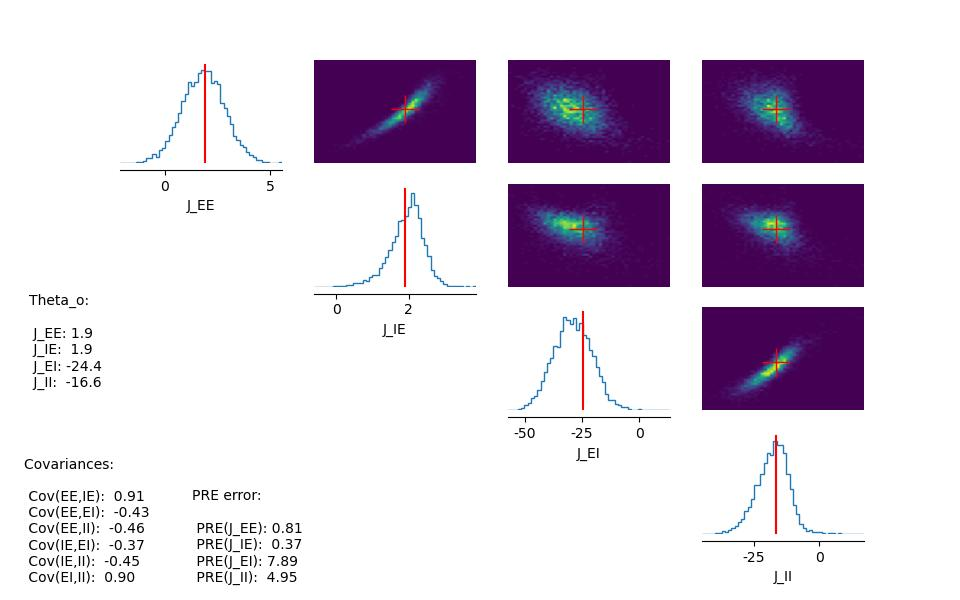
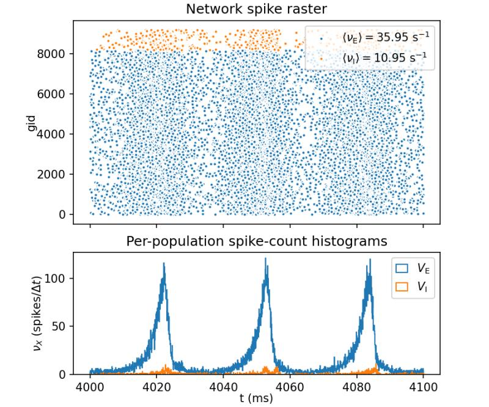

# Methods for Inferring Cortical Circuit Parameters Based on Simulations of Biophysical Brain Models

This repository contains the codebase for my Final Degree Project (Trabajo de Fin de Grado - TFG). The project explores and compares methods for **Simulation-Based Inference (SBI)** to estimate the underlying synaptic coupling parameters of a cortical neural circuit using macroscopic signals like the Current Dipole Moment (CDM).

## Overview

The activity of complex biophysical networks, such as Leaky Integrate-and-Fire (LIF) neural models, is highly dependent on their internal parameters (e.g., recurrent synaptic connections: $J_{EE}$, $J_{IE}$, $J_{EI}$, $J_{II}$). This project aims to infer these parameters from simulated recordings using Neural Density Estimators. 

Two main approaches are evaluated and compared using the Sequence Neural Posterior Estimation (SNPE) algorithm from the `sbi` library:
1. **Raw Time-Series Embedding**: Feeding the raw CDM signals directly into a fully connected embedding neural network to learn a summary representation.
2. **Feature Extraction**: Extracting 22 canonical time-series characteristics using the `pycatch22` package and using these features to estimate the posterior distribution. 

Both results are robustly cross-validated (10-fold CV) and assessed using metrics like Parameter Recovery Error (PRE), covariance between 2D marginals, and Posterior Predictive Checks (PPC).

## Visualizations

| Simulation Data | Neural Spikes |
|:-:|:-:|
|  |  |

## Repository Structure

- `LIF_model/`: Contains codes and simulation data of the biophysical Leaky Integrate-and-Fire network.
- `extract_features.py`: Script to process simulation data, prune the transient responses, and extract 22 scalar features per signal using the `pycatch22` package.
- `SBI_CDM.py`: Performs Simulation-Based Inference directly on the raw CDM macroscopic signals leveraging a fully connected embedding network.
- `SBI.py`: Performs Simulation-Based Inference over the previously extracted canonical features (from `extract_features.py`). Includes comprehensive evaluation (PRE, PCC, and sample visualization pairs).
- `mouses_features.py` & `mouse_study.py`: Scripts aimed at applying the developed methodology to study empirical recordings obtained from mouse models.

## Dependencies

The project relies on the following key libraries:
- `numpy`, `matplotlib`, `scikit-learn`
- `torch` (PyTorch) for neural networks
- `sbi` for Simulation-Based Inference tools
- `pycatch22` for time-series feature extraction

## Getting Started

1. **Feature Extraction**: If working with the feature-based pipeline, run `extract_features.py` over your simulation folders to generate the `features.npy` and `theta_data.npy` datasets.
2. **Inference (Raw Data)**: Run `SBI_CDM.py` to train the neural density estimators on the raw current dipole moments.
3. **Inference (Features)**: Run `SBI.py` to train and evaluate the SNPE process using the pre-extracted `pycatch22` features. Results will be evaluated step-by-step per CV fold.

## Author

Alejandro Rueda López
*(Final Degree Project / TFG)*
